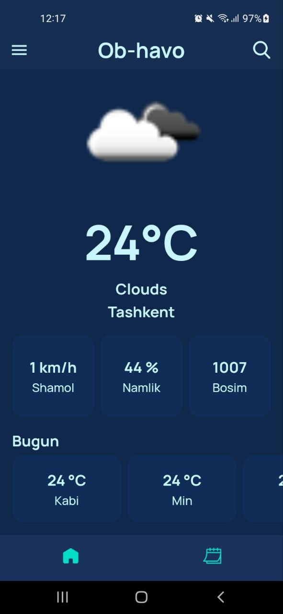
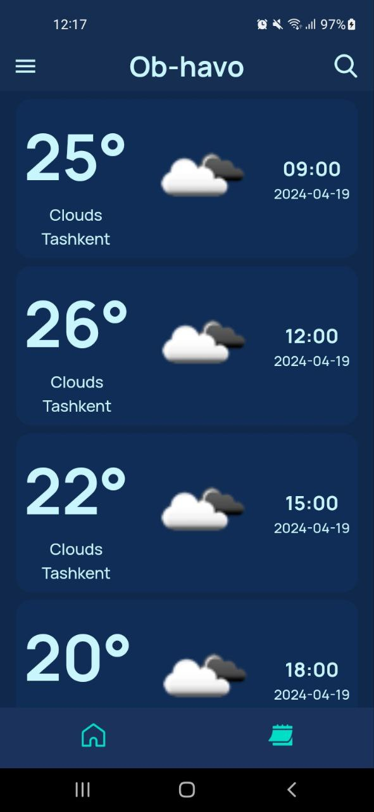

# WeatherScience

Restaurant finder is ... .

<p float="center">
  
   
  
   
  
  
  
</p>

## Versions

```bash
Flutter - 3.19.6
Dart - 3.3.4
Xcode - 15.3.1
Android Studio - 2023.2.1
```

## Start

```sh
flutter pub get
```

```sh
dart run flutter_native_splash:create
```

```sh
flutter pub run flutter_launcher_icons
```

```sh
dart run build_runner build --delete-conflicting-outputs
```

Generate splash screen

```sh
dart run flutter_native_splash:create
```

Generate launcher screen

```sh
dart run icons_launcher:create
```
# FindRest