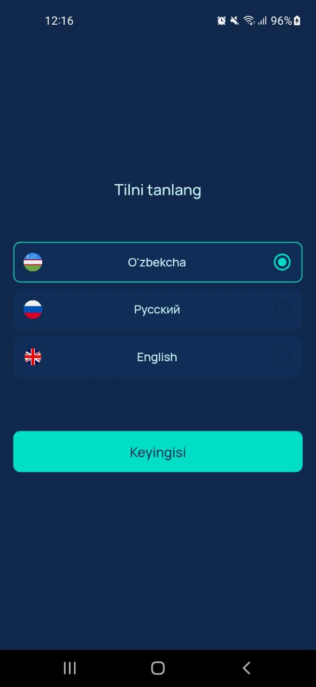

# WeatherScience

<p float="center">
  
   
  
   
  
  
  
</p>


## Versions

```bash
Flutter - 3.19.6
Dart - 3.3.4
Xcode - 15.3.1
Android Studio - 2023.2.1
```

## Start

```sh
flutter pub get
```

```sh
dart run flutter_native_splash:create
```

```sh
flutter pub run flutter_launcher_icons
```

```sh
dart run build_runner build --delete-conflicting-outputs
```

Generate splash screen

```sh
dart run flutter_native_splash:create
```

Generate launcher screen

```sh
dart run icons_launcher:create
```
# WeatherScience

#      About app

   - The application is designed to view one-day and 5-day weather information. 
   - Used free api from [openweathermap.org](https://openweathermap.org/) to get weather data.
   - Used Firebase Google auth and Email and Password login for auth.
   - The test task was performed using the following libraries, patterns and technologies:
      * Flutter BLoC/Cubit
      * JsonSerializable/Freezed
      * Clean Architecture
      * Dio + DioInterceptor
      * Route Generation
      * Dividing the UI into widgets
      * Data cache: hive/hive_flutter
      * Select language: easy_localization
      * Adaptation of widgets to the device:  flutter_screenutil
      * For Auth with Firebase google_sign_in and firebase_auth
      * Cache network image cached_network_image
      * Injectable get_it
      * UseCase
   - FirebaseCrashlytics was used to analyze the errors generated in the application
